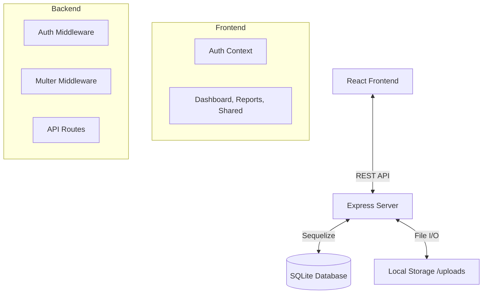

# Digital Health Wallet

A secure, accessible Health Wallet web application where users can upload test reports, track vitals over time, and share records with family or doctors.

## 🛠️ Technology Stack

- **Frontend:** ReactJS (Vite), TailwindCSS, Recharts, Axios, Lucide-React
- **Backend:** Node.js, Express.js, Sequelize ORM
- **Database:** SQLite
- **File Storage:** Local filesystem (`server/uploads`)

## 🧱 Architecture

### System Diagram


### Components
- **Frontend**: Single Page Application (SPA) handling user interaction, visualizing heart rate/BP trends via Recharts, and managing authentication state.
- **Backend**: RESTful API ensuring secure access control using JWT. Handles file uploads and serves them only to authorized users (Access Control Logic).
- **Database**: Relational schema (Users, Reports, Vitals, AccessGrants) ensuring integrity and efficient querying.

## 🚀 Setup Instructions

### Prerequisites
- Node.js installed

### 1. Backend Setup
1. Navigate to the `server` directory:
   ```bash
   cd server
   ```
2. Install dependencies:
   ```bash
   npm install
   ```
3. Start the server:
   ```bash
   node server.js
   ```
   Server runs on `http://localhost:5000`.

### 2. Frontend Setup
1. Open a new terminal and navigate to the `client` directory:
   ```bash
   cd client
   ```
2. Install dependencies:
   ```bash
   npm install
   ```
3. Start the development server:
   ```bash
   npm run dev
   ```
   App runs on `http://localhost:5173`.

## 🔐 Security
- **Authentication**: Passwords are hashed using `bcrypt` before storage. JWT tokens are used for session management.
- **Access Control**: 
  - Reports are private by default.
  - Users can grant `read-only` access to specific other users via email.
  - Backend verifies ownership or presence of an `AccessGrant` before serving files.
- **Data Protection**: File paths are stored in DB, but files are served via a protected route (`/api/reports/:id/file`) that validates permissions, preventing direct URL access.

## 📦 Features
- **User Management**: Sign up/Login with secure authentication.
- **Vitals Tracking**: Add and visualize health metrics (Heart Rate, BP, Blood Glucose, Weight) with interactive charts.
- **Report Management**: 
  - Upload medical reports (PDF, images) via web interface
  - Filter reports by type, date range, or search by title
  - Download/View reports securely
  - **Share via WhatsApp**: One-click sharing of report links through WhatsApp
- **Selective Sharing**: Grant access to specific reports to trusted contacts (family members, doctors, friends).
- **Mobile & Multi-Channel Upload**: Upload reports from any device (see instructions below).

## 📱 Mobile & WhatsApp Upload

### Web Upload from Mobile
1. Open the Digital Health Wallet website on your mobile browser
2. Navigate to the "Reports" section
3. Tap "Upload Report"
4. Select files from your device (camera, gallery, or downloads)
5. Fill in report details and upload

### WhatsApp Reports Upload Workflow

**For reports received via WhatsApp:**

1. **Save the Document**:
   - Open WhatsApp and navigate to the chat with the report
   - Tap on the document/image
   - Tap the download/save icon
   - The file will be saved to your device

2. **Upload to Health Wallet**:
   - Open the Digital Health Wallet on your mobile browser
   - Go to Reports → Upload Report
   - Select the saved file from your device
   - Add title, type, and date
   - Submit

**Alternative: Desktop Upload**
- Transfer files from your phone to computer via USB, cloud storage (Google Drive, Dropbox), or email
- Upload through the web interface on desktop

### Future Enhancement: WhatsApp Business API Integration
For automated WhatsApp uploads, we plan to integrate WhatsApp Business API which will allow:
- Direct upload by sending reports to a dedicated WhatsApp number
- Automatic processing and categorization
- Confirmation messages

**Note**: This requires WhatsApp Business API setup, business verification, and webhook infrastructure.

## 🔍 Report Filtering

Filter your reports easily:
- **By Type**: Blood Test, X-Ray, Prescription, MRI, Vaccination
- **By Date Range**: Select start and end dates
- **By Title**: Search for specific reports
- **Clear Filters**: Reset all filters with one click

## 💬 Share Reports via WhatsApp

Each report has a WhatsApp share button that allows you to instantly share report links with family, friends, or doctors.

**How it works:**
1. Click the WhatsApp icon (💬) on any report card
2. WhatsApp opens with a pre-filled message containing:
   - Report title and type
   - Report date
   - Secure link to view the report
3. Select a contact or group to share with
4. Send the message

**Benefits:**
- ✅ No WhatsApp Business API required
- ✅ Works on both mobile and desktop
- ✅ Secure links to your reports
- ✅ Easy sharing with doctors and family members

## 🔐 Security
