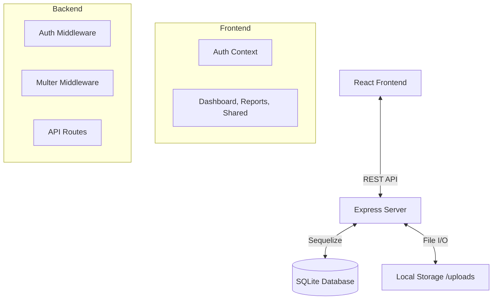

# Digital Health Wallet

A secure, accessible Health Wallet web application where users can upload test reports, track vitals over time, and share records with family or doctors.

## 🛠️ Technology Stack

- **Frontend:** ReactJS (Vite), TailwindCSS, Recharts, Axios, Lucide-React
- **Backend:** Node.js, Express.js, Sequelize ORM
- **Database:** SQLite
- **File Storage:** Local filesystem (`server/uploads`)

## 🧱 Architecture

### System Diagram


### Components
- **Frontend**: Single Page Application (SPA) handling user interaction, visualizing heart rate/BP trends via Recharts, and managing authentication state.
- **Backend**: RESTful API ensuring secure access control using JWT. Handles file uploads and serves them only to authorized users (Access Control Logic).
- **Database**: Relational schema (Users, Reports, Vitals, AccessGrants) ensuring integrity and efficient querying.

## 🚀 Setup Instructions

### Prerequisites
- Node.js installed

### 1. Backend Setup
1. Navigate to the `server` directory:
   ```bash
   cd server
   ```
2. Install dependencies:
   ```bash
   npm install
   ```
3. Start the server:
   ```bash
   node server.js
   ```
   Server runs on `http://localhost:5000`.

### 2. Frontend Setup
1. Open a new terminal and navigate to the `client` directory:
   ```bash
   cd client
   ```
2. Install dependencies:
   ```bash
   npm install
   ```
3. Start the development server:
   ```bash
   npm run dev
   ```
   App runs on `http://localhost:5173`.

## 🔐 Security
- **Authentication**: Passwords are hashed using `bcrypt` before storage. JWT tokens are used for session management.
- **Access Control**: 
  - Reports are private by default.
  - Users can grant `read-only` access to specific other users via email.
  - Backend verifies ownership or presence of an `AccessGrant` before serving files.
- **Data Protection**: File paths are stored in DB, but files are served via a protected route (`/api/reports/:id/file`) that validates permissions, preventing direct URL access.

## 📦 Features
- **User Management**: Sign up/Login.
- **Vitals Tracking**: Add and visualize health metrics (Heart Rate, BP, etc.).
- **Report Management**: Upload/View PDF or Image reports.
- **Sharing**: Grant access to trusted contacts.
